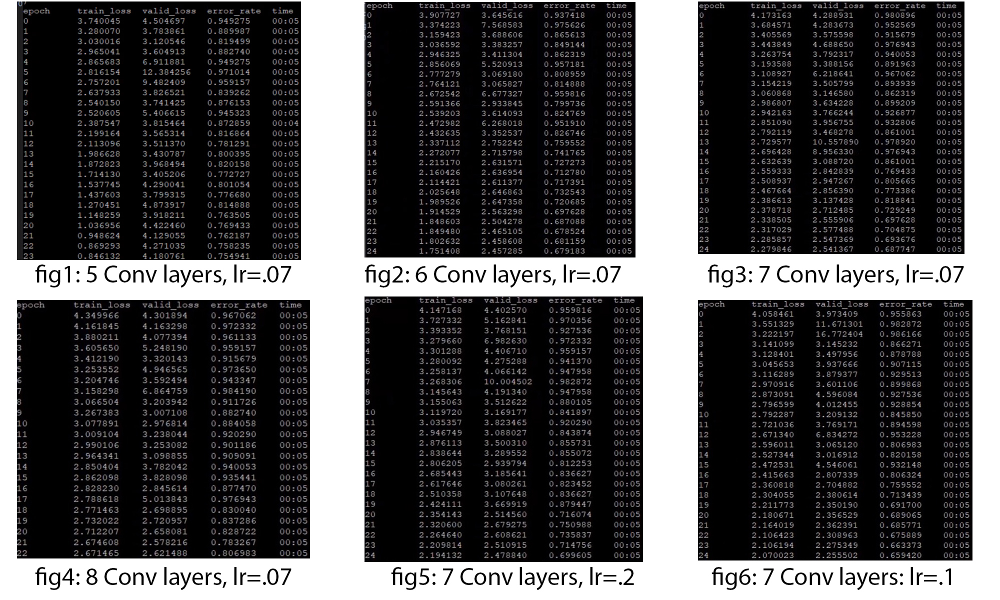

## Neural Unearthing

Group members: Nick Marsano, Daniel Tamkin, Adeline Yu
### Introduction
Geoguessing is a popular web-based game where users are able to guess the location of a randomized Google Street View. The game is challenging, so, as avid Geoguessers ourselves, we thought it would be a worthwhile and fun endeavor to make an application that attempts to guess the locations of a given snapshot.

This image dataset (500 GB) we downloaded focused on scene classification as opposed to geographical location classification. Cosnequently, we pivoted our project  to build a Convultional Neural Network that could identify scenes, for example “a village,” “a watering hole,” “a garden”, etc. 

### Methods
The image dataset was found through a research article Geolocation Estimation of Photos using a Hierarchical Model and Scene Classifications (https://openaccess.thecvf.com/content_ECCV_2018/papers/Eric_Muller-Budack_Geolocation_Estimation_of_ECCV_2018_paper.pdf). 

Our intention with this dataset was to create a basic CNN model that could classify an image’s scene. The dataset included 365 different labels for images, which included “watering hole,” “ball pit,” “village,” etc. 

We implemented our model using PyTorch. To start, we wanted to work with a smaller batch of images, since our final batch would take well over 2 hours to run. We ran our model on 7000 training images. We used the ImageDataLoader from FastAI to load in our training images. We ran our model with 25 epochs. When we were ready, we ran our model on 1,825,000 training images and 36,500 validation images. 

We played around with the number of layers in our CNN model, the learning rate, and the inclusion of a dropout layer (which we did not find helpful in our case). We tested our model against ResNet18 and ResNet50. Discussion on our results follows in the next section. 

### Results

### Reflection

### Literature Review

There is a various collection of pre-existing studies that we took inspiration from, ranging from scene classification to location classification based on an input of an image snapshot. 

Source: http://graphics.cs.cmu.edu/projects/im2gps/im2gps.pdf

The IM2GPS article performed a similar project. They set out with the goal to estimate geolocation from a single image via training a neural network on 6 million images scraped from Flickr and labeled with geotags. Using a nearest neighbor algorithm to compare individual photos with each of their 6 million images, comparing features such as line features, tiny images, color histograms built from the images, and more, they displayed the geographic location of a photo as a probability distribution over the Earth’s surface.

Source: https://arxiv.org/abs/1810.03077
These researchers share a similar intent as us with creating a model that could do well at playing the game GeoGuessr. They ended up  making a model that was 20 times better than chance at predicting random locations  in the US. This model could beat humans in 4 out of 5 rounds of the game. They created the 50states10K dataset which is a set of 125000 samples, 10000 unique images of each of the 50 states gathered from Google Street View. This is a dataset we are interested in looking at for our project.  

Source: https://arxiv.org/abs/1602.05314
This article approaches the issue of photo geolocation through image classification. They subdivided the earth into thousands of multi-scale geoegraphic cells and trained a neural network using millions of geotagged images. Rather than using landmarks or approximate matching, their models integrate multiple visual cues to guess the image location. Their’s exceeded all others and even attained superhuman levels of accuracy in some cases.

Source: https://phys.org/news/2008-06-geographic-photos.html
This article describes the IM2GPS algorithm designed by Carnegie Mellon University. The algorithm doesn’t attempt to identify distinguishing features within the photo but rather “analyzes the composition of the photo, notes how textures and colors are distributed and records the number and orientation of lines in the photo.” and then searching Flickr for similar photos. Instead of asking the computer to analyze a photo, the computer just needs to find photos that look like a given photo.

### Ethics
We did not see any large ethical implications of our project. Perhaps an application of this project could lead to misclassifications of certain locations but we see those implications to be currently trivial. 

Instead we chose to look at a research project that used image classification in a problematic way: to determine criminality. The paper is titled Automated Inference on Criminality Using Face Images. Source: https://arxiv.org/pdf/1611.04135v1.pdf

Some researchers from Shanghai Jiao Tong University collected ID photos of Chinese males and tested various classification techniques to see how effective these techniques were in recognizing whether the photo was of a criminal or not. They boast that their CNN achieved 89.51% accuracy. They also claim they used other classification techniques to find distinguishing features of “what makes a criminal a criminal.”

Their paper unconvingily portrays their intent as innocent, however, social perception based on physical appearance is, at the root, a highly problematic behavior. The program they want to build predicts someone’s membership to a group based on physical appearances. This is simply just reinforcing pre-existing biases. 

As a byproduct, the paper raises an important concern of what we should be using CNNs for. Are we reinforcing biases and discriminating against certain groups with our programs? In what ways are we unknowingly harming society in general? 

